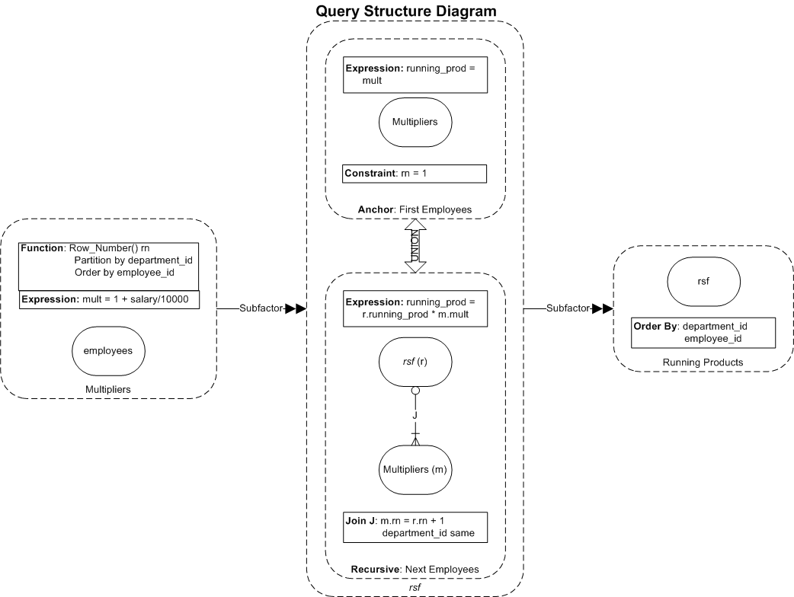
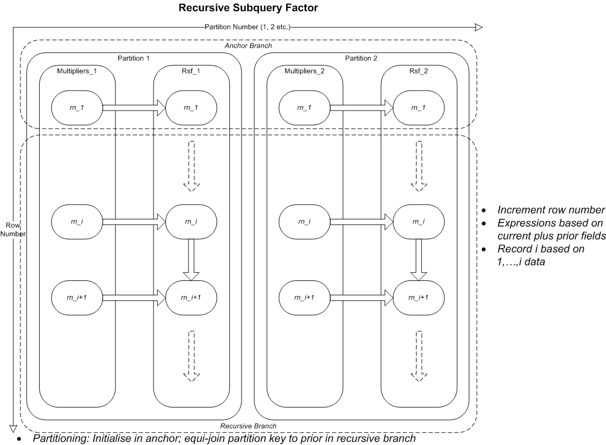

# Oracle SQL Projects / analytics_and_recursion_explainers
This project has the code and other artefacts for small SQL projects, including mp4 recordings that explain the project.

## analytics_and_recursion_explainers
The analytics_and_recursion_explainers subproject has the scripts and artefacts for a Twitter thread in which I explain how three SQL techniques work, in a single tweet recording (< 2m20s) each.

- [Analytic and Recursive SQL by Example](http://aprogrammerwrites.eu/?p=2702)
- [Twitter Thread](https://twitter.com/BrenPatF/status/1228610471391113216)

### Analytic Functions

Recording     | SQL Script    | Tweet
--------------|---------------|----------------------------------
Analytics.mp4 | analytics.sql | [SQL Analytic Functions in a Tweet](https://twitter.com/BrenPatF/status/1228610471391113216)

[Oracle Doc: SQL for Analysis and Reporting](https://docs.oracle.com/en/database/oracle/oracle-database/19/dwhsg/sql-analysis-reporting-data-warehouses.html#GUID-20EFBF1E-F79D-4E4A-906C-6E496EECA684)

### Model Clause

Recording     | SQL Script    | Tweet
--------------|---------------|----------------------------
Model.mp4     | model.sql     | [SQL Model Clause in a Tweet](https://twitter.com/BrenPatF/status/1228611039505330176)

[Oracle Doc: SQL for Modeling](https://docs.oracle.com/en/database/oracle/oracle-database/19/dwhsg/sql-modeling-data-warehouses.html#GUID-538F78AA-9BF3-46F2-93D1-39A8739B3237)

### Recursive Subquery Factors

Recording     | SQL Script    | Tweet
--------------|---------------|------------------------------------------
RSF.mp4       | rsf.sql       | [SQL Recursive Subquery Factors in a Tweet](https://twitter.com/BrenPatF/status/1228958230304436225)


[Oracle Doc: Recursive Subquery Factoring](https://docs.oracle.com/en/database/oracle/oracle-database/19/sqlrf/SELECT.html#GUID-CFA006CA-6FF1-4972-821E-6996142A51C6__I2077142)

Here's a query structure diagram for the final recursive query:


and a diagram showing partitioning and flow through the iterations for same:


## Running the Scripts
You must have the Oracle hr demo schema installed on an Oracle database of at least v11.2 (see [README: Oracle SQL Projects](../README.md)).
### [Schema: hr; Folder: analytics_and_recursion_explainers]

- Run scripts from sqlplus:
```
SQL> @analytics
SQL> @model
SQL> @rsf
```
